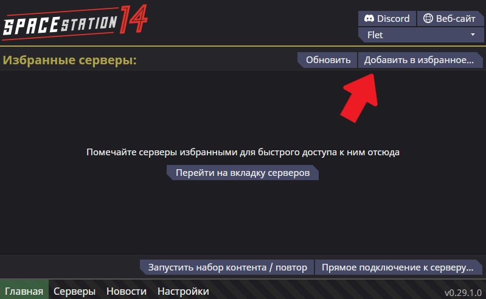

<!--

 ███████████ ██████████
░░███░░░░░░█░░███░░░░███
 ░███   █ ░  ░███   ░░███  ██████  █████ █████
 ░███████    ░███    ░███ ███░░███░░███ ░░███
 ░███░░░█    ░███    ░███░███████  ░███  ░███
 ░███  ░     ░███    ███ ░███░░░   ░░███ ███
 █████       ██████████  ░░██████   ░░█████
░░░░░       ░░░░░░░░░░    ░░░░░░     ░░░░░

--><!DOCTYPE html><html lang="ru" data-scrapbook-source="https://ss14.su/quickstart" data-scrapbook-create="20241105175504237" data-scrapbook-title="SS14: Как начать играть"><head>
            

<!-- Google Tag Manager -->

<!-- End Google Tag Manager -->
<meta charset="UTF-8">
<title>SS14: Как начать играть</title>
<meta name="keywords" content="ss14, space station 14, ss14 сервер, Giedi Prime, Гьеди Прайм, сосаки, рп, ролевая игра">
<meta name="description" content="Начни играть в Space Station 14 прямо сейчас!">
<meta property="og:title" content="SS14: Как начать играть">
<meta property="og:type" content="website">
<meta property="og:image" content="/img/logo_test.png?v=">
<meta property="og:image:secure_url" content="/img/logo_test.png?v=1">
<meta property="og:description" content="Начни играть в Space Station 14 прямо сейчас!">
<meta name="viewport" content="width=device-width, initial-scale=1">
<link rel="shortcut icon" type="/image/png" href="logo_test.png">

<link href="normalize.min.css" type="text/css" rel="stylesheet">
<link href="advance.css" type="text/css" rel="stylesheet">
<link href="icons.css" type="text/css" rel="stylesheet">

<link rel="canonical" href="https://ss14.su/quickstart">
    </head>
<body class="body" lang="ru">
<!-- Top.Mail.Ru counter -->

<noscript>

</noscript>
<!-- /Top.Mail.Ru counter -->
<!-- Google Tag Manager (noscript) -->
<noscript><iframe src="index_1.html" height="0" width="0" style="display:none;visibility:hidden"></iframe></noscript>
<!-- End Google Tag Manager (noscript) -->

    

    
    
    
    

    
    

        
<b>flet__ (Flet)</b> <a class="deauth_button" href="https://ss14.su/?q=login&amp;code=0">Выйти</a>

    

<header>
    <nav>
    <a class="logo hlink" href="https://ss14.su/">
        <picture>
            <source srcset="logo_test.webp" type="image/webp">
            
        </picture>

    </a>
    <a class="hlink high-priority" href=""><i class="lni lni-play"></i> Играть</a>
    <a class="hlink" target="_blank" href="https://wiki.ss14.su/"><i class="lni lni-book"></i> Wiki</a>
    <a class="hlink" target="_blank" href="https://ss14.su/maps"><i class="lni lni-map"></i> Карта</a>
    

        <a class="hlink" href="https://ss14.su/bans"><i class="lni lni-ban"></i> Баны</a>
        <a class="hlink" href="https://ss14.su/jobbans"><i class="lni lni-flag"></i> Jobs</a>
    

    

    

        <a class="hlink" href="https://ss14.su/funding"><i class="lni lni-coin"></i>

Поддержать

</a>
        <a class="hlink" target="_blank" href="https://discord.ss14.su/"><i class="lni lni-discord-alt"></i>

Discord

</a>
        <a class="hlink" target="_blank" href="https://github.com/frosty-dev"><i class="lni lni-github-original"></i>

Github

</a>
        <a class="hlink" target="_blank" rel="nofollow" href="https://forum.ss14.su/"><i class="lni lni-bubble"></i>

Форум

</a>
                    <a class="hlink" href="https://ss14.su/capitum"><i class="lni lni-grid-alt"></i>

Опросы

</a>
            <a class="hlink" href="https://ss14.su/profile"><i class="lni lni-information"></i>

Профиль

</a>
            

</nav></header>
<main class="white-box">
    <h1 class="middle_title">Как начать играть</h1>

    

    
    
    
    

    <!--<h2>Надёжный метод</h2>
    <ol type="1">
        <li>
            Зайди на замечательный сервер Multiverse: <a href="https://discord.gg/HDRqrg8Ca8" target="_blank">https://discord.gg/HDRqrg8Ca8</a>
        </li>
        
        <li>
            Перейди в <code>#about</code> Discord-сервера <code>Space Station Multiverse</code>
        </li>
        
        <li>
            <b><u>Пролистай ниже и нажми на кнопочку</u></b> <code>Get SSMV Steam Key</code>
        </li>
        
        <li>
            Перейди по ссылке для активации ключика и скачай лаунчер из <code>Steam</code>
        </li>
        
        <li>
            Прочитай обязательно <a href="https://wiki.ss14.su/beginnersguide" target="_blank">руководство для новичков</a>
        </li>
        
        <li>
            Запусти лаунчер, зарегистрируйся в нём, найди любой сервер <code>Giedi Prime</code> и играй!
        </li>
        
    </ol>-->
    <h2>Как начать играть</h2>
    <ol type="1">
        <li>
            Необходимо скачать официальный лаунчер Space Station 14:
        </li>
        

            

    

        <a class="launcher_steam" href="https://store.steampowered.com/app/1255460/Space_Station_14/" target="_blank" rel="nofollow">
            Steam
        </a>
        <a class="launcher_win" href="https://github.com/space-wizards/SS14.Launcher/releases/latest/download/SS14.Launcher_Windows.zip" target="_blank" rel="nofollow">
            Windows
        </a>
        <a class="launcher_linux" href="https://flathub.org/apps/com.spacestation14.Launcher" target="_blank" rel="nofollow">
            Linux
        </a>
        <a class="launcher_mac" href="https://github.com/space-wizards/SS14.Launcher/releases/latest/download/SS14.Launcher_macOS.zip" target="_blank" rel="nofollow">
            Mac
        </a>
    

        

        <li>
            Необходимо Войти/Создать аккаунт в лаунчере, затем нажать на кнопку <code>Добавить в избранное...</code>
        </li>
        
        <li>
            В открывшемся окне вводим следующее: 
            <b>Название</b>: <code id="copy_me">Maiden</code> 
            <b>Адрес</b> <code id="copy_me">ss14s://ludere.ss14.su/maid</code> 
            И жмём кнопку <code>Add</code>
        </li>
        
        <li>
            Жмём кнопку <code>Подключиться</code> и наслаждаемся игрой!
        </li>
        
    <h2>Альтернативный хаб</h2>
    </ol>
    <ol type="a">
        <li>
            Заходим в настройки хабов и вписываем эту ссылку <code id="copy_me">https://hub.ss14.su/</code> и жмём <code>Готово</code>
        </li>
        
        <li>
            Ищем сервер <code>Maiden</code> в списке и играем!
        </li>
        
    </ol>

</main>
<footer>
    

    

    
    
    
    

    

        

            

            

        

    

    

        
Дизайн <a href="https://fdev.team/" target="_blank">FDev</a> 2024

        

            <a href="https://ss14.su/tos" class="footer_link">Правила сервиса</a>
            <a href="https://ss14.su/offert" class="footer_link">Публичная оферта</a>
            <a href="https://ss14.su/privacy" class="footer_link">Политика конфиденциальности</a>
            <a href="https://ss14.su/refund" class="footer_link">Условия возврата</a>
            <a href="https://ss14.su/cdn-cgi/l/email-protection#553431383c3b15262664617b2620" target="_blank" class="footer_link">Почта для связи: [email&nbsp;protected]</a>
        

    

    

        

            <nav>
                <a href="https://ss14.su/" class="footer_link">Главная</a>
                <a href="https://ss14.su/servers" class="footer_link">Наши сервера</a>
                <a href="https://wiki.ss14.su/beginnersguide" target="_blank" class="footer_link">Как начать играть</a>
                <a href="https://wiki.ss14.su/" target="_blank" class="footer_link">Wiki</a>
                <a href="https://ss14.su/maps" class="footer_link">Карты</a>
            </nav>
        

    

    

        

            <nav>
                <a href="https://ntts.fdev.team/" target="_blank" class="footer_link">/N/TTS</a>
                <a href="https://discord.ss14.su/" target="_blank" class="footer_link">Discord</a>
                <a href="https://vk.com/ss13ru" target="_blank" class="footer_link">Сообщество ВКонтакте</a>
                <a href="https://t.me/ss13ru" target="_blank" class="footer_link">Канал в Telegram</a>
                <a href="https://ss14.su/funding" target="_blank" class="footer_link">Поддержать</a>
            </nav>
        

    

    

        <h3>Поиграй в Space Station 14 от FDev Team!</h3>
        
Space Station 14 – это бесплатная многопользовательская игра про космонавтиков в вакууме. Инспирированная
            культовой классикой Space Station 13 она рассказывает о том как рядовая смена на станции пошла не так.
            Окунитесь в свою уникальную роль, взаимодействуйте с детально проработанными системами и выживайте во
            время хаоса в этой захватывающей многопользовательской ролевой игре.

        
SS14 вмещает до 2-х тысяч пользователей, играющих по сети. Наши мощные сервера рассчитаны на стабильное
            многопользовательское подключение – постоянно в онлайне более пятиста игроков.

    

</footer>

ASTRUM_94 - СЕРВЕРНОЕ ВРЕМЯ: 05/11/2024 17:55:01

СГЕНЕРИРОВАНО ЗА 5.4 МС

<!-- Yandex.Metrika counter -->

<noscript>
    

</noscript> <!-- /Yandex.Metrika counter -->

</body></html>